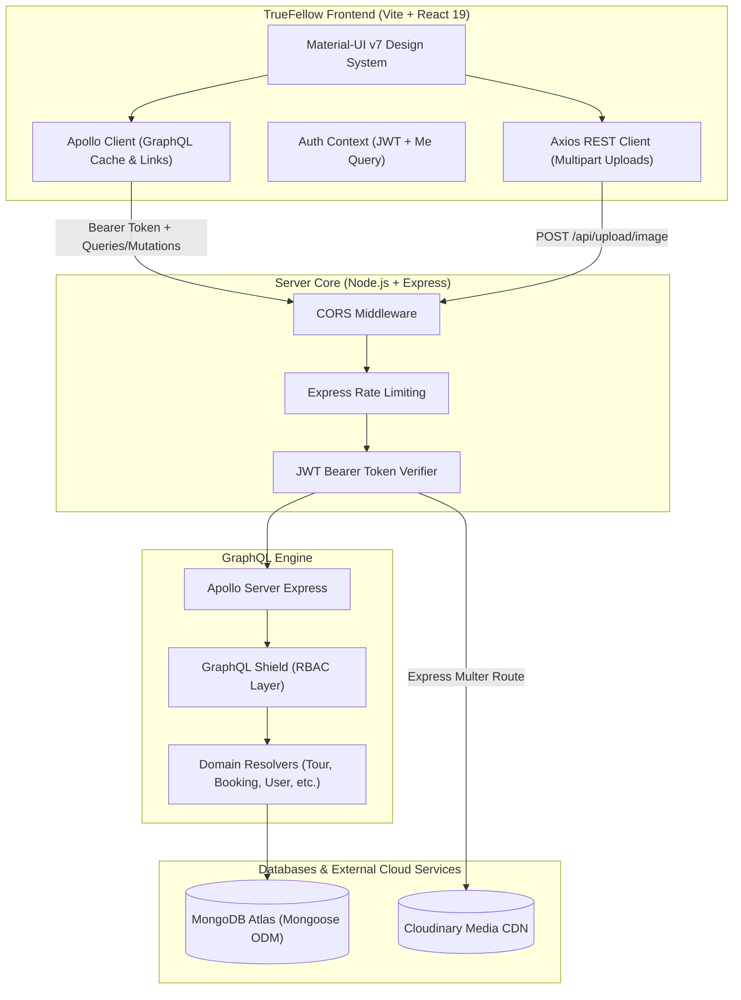

# 🏔️ TrueFellow — Centralized Travel & Tourism Ecosystem

[](https://github.com/kashifniaxi/TrueFellow/tree/staging)
[](https://nodejs.org/)
[](https://react.dev/)
[](https://graphql.org/)
[](https://www.mongodb.com/)
[](https://mui.com/)
[](LICENSE)

> **TrueFellow** is an enterprise-ready, full-stack tourism marketplace designed to connect curious travelers with verified local tour organizers and compatible travel companions. Engineered with a clean monolithic architecture, it combines a performant **GraphQL API**, a **REST media pipeline**, role-based access control, and a responsive **React + Vite** single-page application.

---

## 📑 Table of Contents

- [Key Architecture Highlights](#-key-architecture-highlights)
- [System Architecture & Data Flow](#-system-architecture--data-flow)
- [Role-Based Feature Matrix](#-role-based-feature-matrix)
- [Technology Stack](#-technology-stack)
- [Repository Structure](#-repository-structure)
- [Core Data Models](#-core-data-models)
- [GraphQL API & Schema Design](#-graphql-api--schema-design)
- [REST Endpoints](#-rest-endpoints)
- [Security & Authentication](#-security--authentication)
- [Travel Companion Matching Algorithm](#-travel-companion-matching-algorithm)
- [Local Development Setup](#-local-development-setup)
- [Production Build & Deployment](#-production-build--deployment)
- [Environment Variables Reference](#-environment-variables-reference)

---

## ⚡ Key Architecture Highlights

* **Hybrid API Gateway**: GraphQL handles querying, mutations, and deep relational data graphs (users, tours, reviews, bookings), while dedicated Express REST routes manage multipart binary image streaming to Cloudinary.
* **Role-Based Access Control (RBAC)**: Enforced via **GraphQL Shield** rules (`isAuthenticated`, `isTourist`, `isOrganizer`, `isAdmin`) on every query and mutation, mirrored on the client via React `ProtectedRoute` wrappers.
* **Smart Companion Matching Engine**: A deterministic heuristic engine calculating compatibility scores (0–100%) based on shared interests, travel style, spoken languages, and overlapping budget ranges.
* **High-Performance Front-End**: React 19 + Vite 8 utilizing intelligent manual vendor chunk splitting (`react-vendor`, `mui-vendor`, `apollo-vendor`, `charts-vendor`) for sub-second first contentful paint and minimal bundle footprint.
* **Resilient State & Network Layer**: Apollo Client with custom auth header links, error boundary interceptors for automated JWT expiry eviction, and React Context cache synchronization.

---

## 📐 System Architecture & Data Flow



---

## 👥 Role-Based Feature Matrix

| Feature / Domain | Tourist | Organizer | Admin | Unauthenticated |
|---|:---:|:---:|:---:|:---:|
| **Public Tour Search & Filtering** | ✅ | ✅ | ✅ | ✅ |
| **Interactive Tour Details & Reviews** | ✅ | ✅ | ✅ | ✅ |
| **Booking Creation & Seat Reservation** | ✅ | ❌ | ❌ | ❌ |
| **Travel Companion Compatibility Matching** | ✅ | ❌ | ❌ | ❌ |
| **Saved / Bookmarked Tours Wishlist** | ✅ | ❌ | ❌ | ❌ |
| **Direct Messaging & Conversation Threads** | ✅ | ✅ | ❌ | ❌ |
| **Organizer Onboarding & Document Verification** | ✅ (Apply) | ✅ (Status) | ✅ (Review) | ❌ |
| **Tour Management (Create, Edit, Cancel)** | ❌ | ✅ | ✅ | ❌ |
| **Organizer Revenue & Analytics Dashboard** | ❌ | ✅ | ❌ | ❌ |
| **User Moderation (Ban / Unban / Role Elevation)** | ❌ | ❌ | ✅ | ❌ |
| **System-wide Booking & Dispute Monitoring** | ❌ | ❌ | ✅ | ❌ |

---

## 🛠️ Technology Stack

### Backend Services
* **Runtime**: [Node.js](https://nodejs.org/) (ES Modules)
* **Web Framework**: [Express 4.x](https://expressjs.com/)
* **API Specification**: [GraphQL](https://graphql.org/) via [Apollo Server Express 3.x](https://www.apollographql.com/docs/apollo-server/v3/)
* **Security & Auth**: [GraphQL Shield](https://the-guild.dev/graphql/shield), [jsonwebtoken](https://github.com/auth0/node-jsonwebtoken), [bcrypt](https://github.com/kelektiv/node.bcrypt.js)
* **Database & ODM**: [MongoDB](https://www.mongodb.com/) with [Mongoose 8.x](https://mongoosejs.com/)
* **File Processing**: [Multer](https://github.com/expressjs/multer) with memory storage buffer
* **Media Cloud**: [Cloudinary SDK](https://cloudinary.com/) (Direct streaming upload)
* **Logging**: [Winston](https://github.com/winstonjs/winston) structured logger

### Frontend Client
* **Framework**: [React 19](https://react.dev/) + [Vite 8](https://vitejs.dev/)
* **UI Component Suite**: [@mui/material v7](https://mui.com/), `@mui/icons-material`
* **Data Visualizations**: Recharts
* **State & Data Fetching**: [@apollo/client 3.13](https://www.apollographql.com/docs/react/)
* **Routing**: [React Router v7](https://reactrouter.com/)
* **Styling**: Emotion styled engine + CSS Custom Property Tokens
* **Typography**: Outfit & Plus Jakarta Sans

---

## 📂 Repository Structure

```text
TrueFellow/
├── server/                                # Backend Express + Apollo Server
│   ├── src/
│   │   ├── app.js                         # Express setup, middleware & Apollo attachment
│   │   ├── server.js                      # DB connection bootstrap & HTTP server listen
│   │   ├── config/                        # Cloudinary, Database, & Env validation
│   │   ├── errors/                        # Custom domain errors (Auth, Validation, Business)
│   │   ├── graphql/
│   │   │   ├── context.js                 # JWT extraction and active user validation
│   │   │   ├── permissions.js             # Shield rules & mutation permission guards
│   │   │   ├── resolvers/                 # Domain-separated GraphQL resolvers
│   │   │   │   ├── analytics.resolver.js
│   │   │   │   ├── auth.resolver.js
│   │   │   │   ├── booking.resolver.js
│   │   │   │   ├── dashboard.resolver.js
│   │   │   │   ├── message.resolver.js
│   │   │   │   ├── notification.resolver.js
│   │   │   │   ├── review.resolver.js
│   │   │   │   ├── tour.resolver.js
│   │   │   │   └── user.resolver.js
│   │   │   └── schema/                    # Modular GraphQL type definitions
│   │   ├── middlewares/                   # Express middlewares (Auth, Roles, Rate limiting)
│   │   ├── models/                        # Mongoose schemas & indexes
│   │   │   ├── Booking.model.js
│   │   │   ├── Message.model.js
│   │   │   ├── Notification.model.js
│   │   │   ├── OrganizerProfile.model.js
│   │   │   ├── Review.model.js
│   │   │   ├── Tour.model.js
│   │   │   └── User.model.js
│   │   ├── routes/                        # Express REST routes (Image upload)
│   │   ├── services/                      # Business logic & database operations
│   │   └── utils/                         # Token helpers, loggers, formatters
│   ├── test_flow.js                       # Service integration test script
│   ├── .env.example                       # Backend environment template
│   └── package.json
│
├── TrueFellow-Frontend/                   # Client React Single Page Application
│   ├── public/                            # Favicon, SVGs, static assets
│   ├── src/
│   │   ├── assets/                        # Brand images and vector illustrations
│   │   ├── components/                    # Reusable UI component library
│   │   │   ├── Footer.jsx
│   │   │   ├── ImageUpload.jsx            # Drag-and-drop Cloudinary uploader
│   │   │   ├── MessagesInbox.jsx          # Live messaging dialog & thread list
│   │   │   ├── Navbar.jsx                 # Dynamic navigation with notification popover
│   │   │   ├── ProtectedRoute.jsx         # RBAC route guard
│   │   │   └── TourCard.jsx               # Tour preview card with bookmarking
│   │   ├── context/                       # Global state (AuthContext)
│   │   ├── graphql/                       # Apollo client setup & GraphQL document operations
│   │   │   ├── client.js
│   │   │   └── operations.js
│   │   ├── pages/                         # Route-level views & dashboards
│   │   │   ├── AdminDashboard.jsx         # Platform moderation & verification queue
│   │   │   ├── ApplyOrganizer.jsx         # Organizer verification form
│   │   │   ├── Home.jsx                   # Tour discovery, filter bar & hero
│   │   │   ├── Login.jsx & Register.jsx   # Authentication forms
│   │   │   ├── OrganizerDashboard.jsx     # Tour CRUD & revenue metrics
│   │   │   ├── TourDetails.jsx            # Itinerary, reviews & booking checkout
│   │   │   └── TouristDashboard.jsx       # My bookings, saved tours & companion matches
│   │   ├── theme/                         # MUI Palette, Typography, & Component overrides
│   │   ├── utils/                         # Configuration constants & image URL helpers
│   │   ├── App.jsx                        # Application root & Route definitions
│   │   └── index.css                      # Global design system & utility classes
│   ├── vite.config.js                     # Vite build & chunk splitting configuration
│   ├── .env.example                       # Frontend environment template
│   └── package.json
│
└── README.md                              # Unified system documentation
```

---

## 🗄️ Core Data Models

```text
┌────────────────┐       ┌─────────────────┐       ┌────────────────┐
│      User      │◄──────┤     Booking     │──────►│      Tour      │
│────────────────│       │─────────────────│       │────────────────│
│ _id            │       │ _id             │       │ _id            │
│ name           │       │ tour (Ref)      │       │ title          │
│ email          │       │ tourist (Ref)   │       │ price          │
│ role           │       │ seats           │       │ capacity       │
│ travelPrefs    │       │ totalAmount     │       │ availableSeats │
│ isVerified     │       │ status          │       │ organizer(Ref) │
│ isActive       │       │ companionMatch  │       │ itinerary []   │
└────────────────┘       └─────────────────┘       └────────────────┘
         ▲                                                  ▲
         │                                                  │
┌────────────────┐                                 ┌────────────────┐
│OrganizerProfile│                                 │     Review     │
│────────────────│                                 │────────────────│
│ user (Ref)     │                                 │ tour (Ref)     │
│ businessName   │                                 │ user (Ref)     │
│ licenseNumber  │                                 │ rating (1-5)   │
│ documentUrl    │                                 │ comment        │
│ verification   │                                 └────────────────┘
└────────────────┘
```

---

## 🔌 GraphQL API & Schema Design

### Primary Queries

| Query | Permission | Description |
|---|---|---|
| `tours(filter, page, limit)` | Public | Search published tours with multi-facet filters (city, budget, duration). |
| `tour(id)` | Public | Fetch comprehensive tour details including itinerary, FAQs, and organizer info. |
| `myBookings` | Authenticated (Tourist) | Retrieve current user's booking history and seat confirmations. |
| `myTours(status, page, limit)` | Authenticated (Organizer) | List organizer's tours with booking metrics. |
| `matchCompanions(tourId)` | Authenticated (Tourist) | Find other tourists booked on the same tour with compatibility scores. |
| `getMyConversations` | Authenticated | Retrieve latest messages grouped by conversation partner. |
| `userDashboard` | Authenticated (Tourist) | Aggregated stats: upcoming trips, total spent, companion matches. |
| `organizerDashboard` | Authenticated (Organizer) | Aggregated stats: revenue, booking requests, occupancy rates. |
| `adminDashboard` | Authenticated (Admin) | Platform-wide user metrics, pending verifications, and system revenue. |

### Primary Mutations

| Mutation | Permission | Description |
|---|---|---|
| `register(input)` | Public | Register a new Tourist or Organizer account. |
| `login(input)` | Public | Authenticate credentials and receive access/refresh tokens. |
| `bookTour(input)` | Authenticated (Tourist) | Reserve seats on an active tour with atomic seat decrement. |
| `cancelBooking(bookingId)` | Authenticated (Tourist) | Cancel booking and release reserved seats back to the tour inventory. |
| `createTour(input)` | Authenticated (Organizer) | Create a new tour draft or publish directly. |
| `cancelTour(tourId)` | Authenticated (Organizer) | Cancel an existing tour, refunding/cancelling all active bookings. |
| `applyOrganizer(input)` | Authenticated | Submit business credentials and proof documents for review. |
| `verifyOrganizer(input)` | Authenticated (Admin) | Approve or reject an organizer verification application. |
| `writeReview(input)` | Authenticated (Tourist) | Leave a verified rating and review for a completed tour. |
| `toggleCompanionMatchingOnBooking` | Authenticated (Tourist) | Opt in or out of social companion matching on a booking. |

---

## 🌐 REST Endpoints

While GraphQL powers application data, file uploads use dedicated REST endpoints with streaming memory buffers for maximum efficiency:

```http
POST /api/upload/image
Content-Type: multipart/form-data
Authorization: Bearer <JWT_ACCESS_TOKEN>

Form Data:
  file: <binary image (png, jpg, webp, max 5MB)>
  folder: "tours" | "profiles" | "documents"
```

**Response (200 OK)**:
```json
{
  "url": "https://res.cloudinary.com/truefellow/image/upload/v1234567890/tours/tour_sample.webp",
  "format": "webp",
  "width": 1920,
  "height": 1080
}
```

---

## 🔒 Security & Authentication

1. **Token Flow**:
   * **Access Token**: Short-lived (15 minutes), signed with `JWT_SECRET`, transmitted via HTTP `Authorization: Bearer <token>`.
   * **Refresh Token**: Long-lived (7 days), signed with `JWT_REFRESH_SECRET`, used to renew access tokens without re-authenticating.
2. **Account Status Verification**: GraphQL context checks both user existence and `isActive: true`. Banned or deactivated users have token access revoked immediately.
3. **Password Hashing**: Bcrypt salt rounds configured to 10 for resistant credential encryption.
4. **Rate Limiting**: Express middleware protects against brute-force authentication attempts (`100 requests per 15-minute window`).
5. **CORS Security**: Whitelisted cross-origin configuration ensuring API communication only from authorized clients.

---

## 🤝 Travel Companion Matching Algorithm

The matching engine in `server/src/services/travelPartner.service.js` calculates compatibility between tourists sharing a confirmed booking:

$$\text{Score} = \text{Interests} + \text{Travel Style} + \text{Languages} + \text{Budget Overlap}$$

* **Shared Interests** *(Max 40 pts)*: $+10\text{ pts}$ per common interest (e.g., *Photography*, *Hiking*, *Culinary*).
* **Travel Style** *(25 pts)*: Exact match on style (e.g., *Backpacking*, *Luxury*, *Relaxed*).
* **Shared Languages** *(Max 20 pts)*: $+10\text{ pts}$ per common spoken language.
* **Budget Overlap** *(15 pts)*: Granted if minimum/maximum budget preferences intersect.

*Users must explicitly toggle `companionMatchingEnabled` on their booking to appear in compatibility searches.*

---

## 🚀 Local Development Setup

### Prerequisites
* [Node.js](https://nodejs.org/) `>= 18.0.0`
* [npm](https://www.npmjs.com/) `>= 9.0.0`
* A running MongoDB instance (or free [MongoDB Atlas Cluster](https://www.mongodb.com/atlas))
* A free [Cloudinary](https://cloudinary.com/) account for image uploads

---

### Step 1: Clone Repository

```bash
git clone https://github.com/kashifniaxi/TrueFellow.git
cd TrueFellow
```

---

### Step 2: Backend Configuration & Start

```bash
cd server
npm install

# Create environment configuration
cp .env.example .env
```

Edit `server/.env` with your credentials:
```env
PORT=4000
MONGO_URI=mongodb+srv://<username>:<password>@cluster0.mongodb.net/truefellow?retryWrites=true&w=majority
JWT_SECRET=your_super_secret_jwt_key
JWT_REFRESH_SECRET=your_super_secret_refresh_jwt_key
CLOUDINARY_CLOUD_NAME=your_cloudinary_cloud_name
CLOUDINARY_API_KEY=your_cloudinary_api_key
CLOUDINARY_API_SECRET=your_cloudinary_api_secret
```

Launch server in watch mode:
```bash
npm run dev
# Server running at http://localhost:4000
# GraphQL Playground available at http://localhost:4000/graphql
```

---

### Step 3: Frontend Configuration & Start

In a new terminal window:

```bash
cd TrueFellow-Frontend
npm install

# Create environment configuration
cp .env.example .env
```

Edit `TrueFellow-Frontend/.env`:
```env
VITE_API_URL=http://localhost:4000
VITE_GRAPHQL_URI=http://localhost:4000/graphql
```

Start the Vite development server:
```bash
npm run dev
# Application will launch at http://localhost:5173
```

---

## 📦 Production Build & Deployment

### Frontend Production Bundle
The client is configured with Vite manual chunk splitting for optimal caching:

```bash
cd TrueFellow-Frontend
npm run build
```
This produces optimized assets in `TrueFellow-Frontend/dist/`:
* `react-vendor`: Core React & DOM runtime
* `mui-vendor`: Material UI & Emotion layout engines
* `apollo-vendor`: Apollo Client & GraphQL parsing
* `charts-vendor`: Recharts data visualization library

Deploy `dist/` to **Vercel**, **Netlify**, **Cloudflare Pages**, or **AWS S3/CloudFront**.

### Backend Production Server
Run the production Node.js cluster:
```bash
cd server
npm start
```
Deploy to **Render**, **Railway**, **Fly.io**, or **AWS ECS/EC2**.

---

## 🔑 Environment Variables Reference

### Backend (`server/.env`)

| Variable | Required | Default | Purpose |
|---|:---:|:---:|---|
| `PORT` | No | `4000` | HTTP port for Express server. |
| `MONGO_URI` | **Yes** | — | MongoDB connection connection URI. |
| `JWT_SECRET` | **Yes** | — | Secret string for signing access tokens. |
| `JWT_REFRESH_SECRET` | **Yes** | — | Secret string for signing refresh tokens. |
| `CLOUDINARY_CLOUD_NAME`| **Yes** | — | Cloudinary cloud identifier. |
| `CLOUDINARY_API_KEY` | **Yes** | — | Cloudinary API access key. |
| `CLOUDINARY_API_SECRET`| **Yes** | — | Cloudinary API secret. |

### Frontend (`TrueFellow-Frontend/.env`)

| Variable | Required | Default | Purpose |
|---|:---:|:---:|---|
| `VITE_API_URL` | **Yes** | `http://localhost:4000` | Base URL for REST endpoints (uploads). |
| `VITE_GRAPHQL_URI` | **Yes** | `http://localhost:4000/graphql` | Base URL for GraphQL Apollo HTTP link. |

---

## 📄 License

This project is licensed under the MIT License — see the [LICENSE](LICENSE) file for details.
